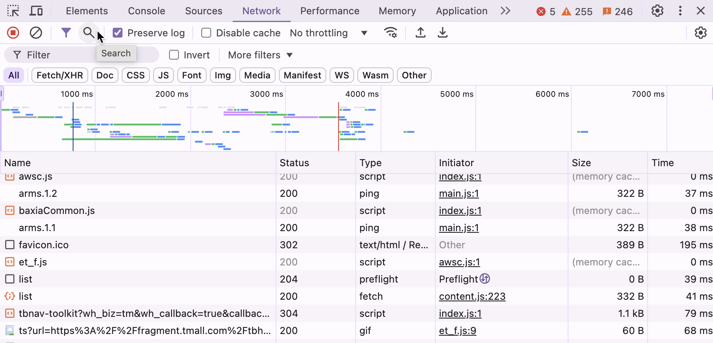
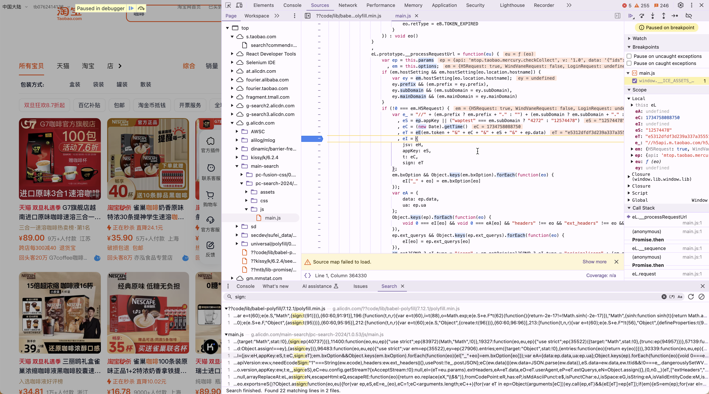
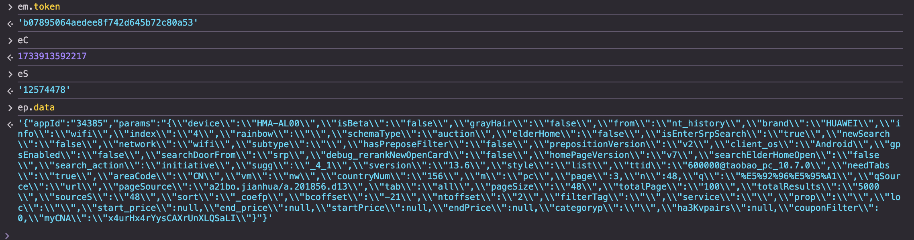
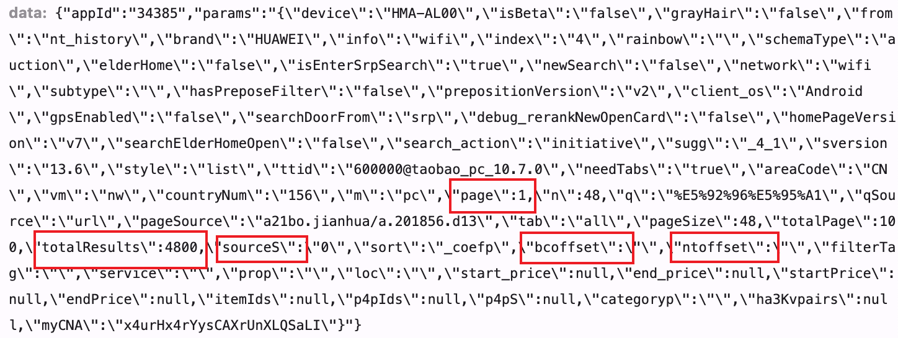
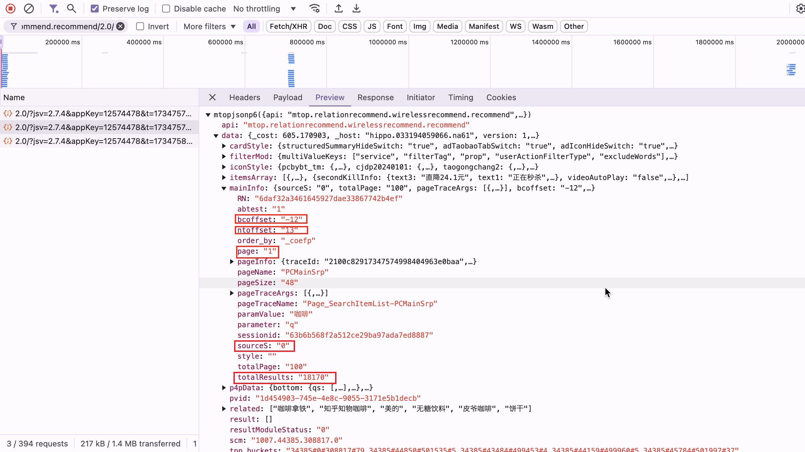

# 淘宝商品Request逆向

作为一个初学者, 我发现互联网上鲜有针对于会点爬虫但又并非经验丰富的开发者的教程, 因此在这个项目中, 我将尝试以一个初学者的角度, 一步一步地逆向抓取淘宝商品信息

在后续我将进一步完善这个项目

- [ ] 找出`em.token`的生成方式
- [ ] 添加 cookie 自动获取与失效更新

## 单页爬取: 初步逆向

### 寻找发送数据包的API

进入商品栏页面, 打开开发者工具, 选择 network, 通过关键词搜索网页上有的数据, 如我搜索`咖啡`, 那么搜索就会给我返回有这个关键词的网络信息, 照着网页内容比对就可以找到需要的链接, 这样顺藤摸瓜我们就可以找到数据包的地址, 它在 `Headers` 中, 是 Request URL 的一部分: 

`https://h5api.m.taobao.com/h5/mtop.relationrecommend.wirelessrecommend.recommend/2.0/`

注意开发者工具中有多个 search



### 破解 sign 加密

在下方的搜索栏中搜索`sign:`关键词, 定位到进行加密的位置



在这里可以看到加密方法:

```js
eS = ep.appKey || ("waptest" === em.subDomain ? "4272" : "12574478"),
eE = (new Date).getTime(),
eT = eC(em.token + "&" + eC + "&" + eS + "&" + ep.data),
eI = {
  jsv: eH,
  appKey: eS,
  t: eC,
  sign: eT
}
```

接下来注意要在此打断点调试, 不要刷新网页, 如果要获取新的值可以向下滑动加载信息或是翻页, 否则时间戳会改变导致加密值改变

猜测为MD5加密可以尝试套一个已知值比如`123456`, 将其用MD5加密, 再在控制台中使用`eT`函数加密这个值, 如果结果相同, 那么我们就可以确定`eT`函数就是MD5加密操作, 随后我们得到`ep.data`和`sign`就基本解决了参数加密问题

接下来我们将上面得到的参数一一复制到代码中, 尝试构建整个请求



这里我在控制台中打印了这些参数值, 这样复制不会出错

单页信息爬取的问题解决, 至于多页问题, 我们就需要对`ep.data`进行更深入的分析

## 多页爬取: 传递参数

查看第一页中访问的API返回的数据:



红框中的参数是我们需要关注的会改变的参数, 通过多次对比每一页传递的参数:



最终可以确定`bcoffset`, `ntoffset`, `sourceS`, `totalResults`这四个参数是由上一页的请求传递给下一次请求的, 因此我们在进行多页爬取的时候, 每次请求后只需要将返回的这四个参数重新传递给`params`再次构建`ep.data`传递给下次请求即可, 每一次请求如此递归传递参数, 我们就可以爬到多页数据

## 后续

等待后期完善反爬措施应对, 错误处理
